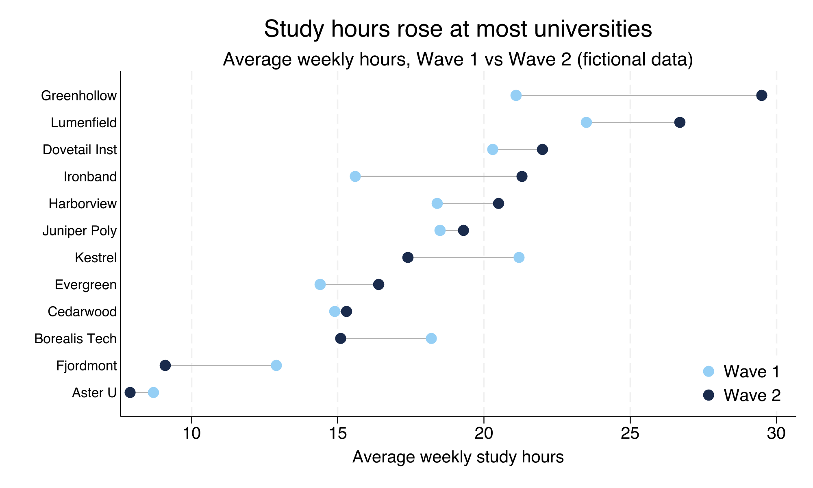

# dumbbell

A Stata command that draws a **dumbbell (connected-dot) plot**: for each category
it plots two time points as markers joined by a line, with categories sorted by
one period's value. Ideal for showing change between two periods across many
groups (e.g. units ranked by their value in *period A* vs *period B*).



## Requirements

- Stata 16 or newer

## Installation

### Option A — `net install` (recommended)

```stata
net install dumbbell, from("https://raw.githubusercontent.com/ganma0517/stata_dumbbell/main/") replace
```

### Option B — `github install`

Requires the community `github` command (`ssc install github` once), then:

```stata
github install ganma0517/stata_dumbbell
```

After installing, read the help and run the example:

```stata
help dumbbell
do dumbbell_example.do
```

## Quick start

A practice dataset is included — **fictional** average weekly study hours at 12
imaginary universities measured in two waves (long format, no real-world source).
Load it directly from the repo (no install needed):

```stata
use "https://raw.githubusercontent.com/ganma0517/stata_dumbbell/main/dumbbell_demo.dta", clear
dumbbell hours, over(school) time(wave) sortby(high)
```

## Data format

Input is **long**: one row per category-time.

| school | wave | hours |
|---|---|---|
| Aster U   | 1 | 8.7  |
| Aster U   | 2 | 8.0  |
| Cedarwood | 1 | 14.9 |
| Cedarwood | 2 | 15.2 |

`time()` must take exactly two values; the smaller is the earlier point, the
larger the later point.

## Syntax

```
dumbbell yvar [if] [in], over(catvar) time(timevar) [options]
```

| Option | Description | Default |
|---|---|---|
| `over(varname)` | category variable (required) | — |
| `time(varname)` | two-valued period variable (required) | — |
| `sortby()` | sort by `high` (later) or `low` (earlier) | high |
| `ascending` / `descending` | order direction | descending |
| `c1()` `c2()` | earlier / later marker colors | light blue / navy |
| `lcolor()` `msize()` `labsize()` | line color / marker size / label size | gs11 / medlarge / small |
| `title()` `subtitle()` `xtitle()` `xlabel()` | titles and x-axis | — |
| `legend()` `l1()` `l2()` | legend on/off and labels | on |
| `saving()` `name()` | export path / window name | — |

See `help dumbbell` for full documentation and examples.

## Files

- `dumbbell.ado` — the command
- `dumbbell.sthlp` — Stata help file
- `dumbbell_example.do` — runnable tutorial
- `dumbbell_demo.dta` — practice data (fictional, long format)
- `example_dumbbell.png` — demo figure
- `dumbbell.pkg`, `stata.toc` — package metadata for `net install`

## About the author

I am Wen-Cheng Lin, a PhD student in the Department of Political Science at
National Chengchi University, currently serving as a postdoctoral research fellow
at the Institute of Sociology, Academia Sinica. This package is a collaboration
between me and Claude. It is still at an experimental stage and is intended mainly
for presenting results from survey-experiment and comparative designs. If you have
any questions, you are warmly welcome to get in touch — beck740517@gmail.com

我是林文正，政治大學政治學系博士生，目前在中央研究院社會學研究所擔任博士後研究員。
本套件是我與 Claude 的協作成果，目前仍屬實驗性階段，主要用於調查實驗法與比較研究的
資訊呈現。若有任何問題，歡迎寫信與我交流。

## Citation

Lin, Wen-Cheng (2026). *dumbbell: Dumbbell plot comparing two time points by
category.* https://github.com/ganma0517/stata_dumbbell

## License

MIT — see [LICENSE](LICENSE).
